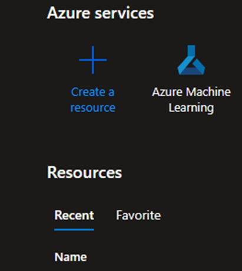
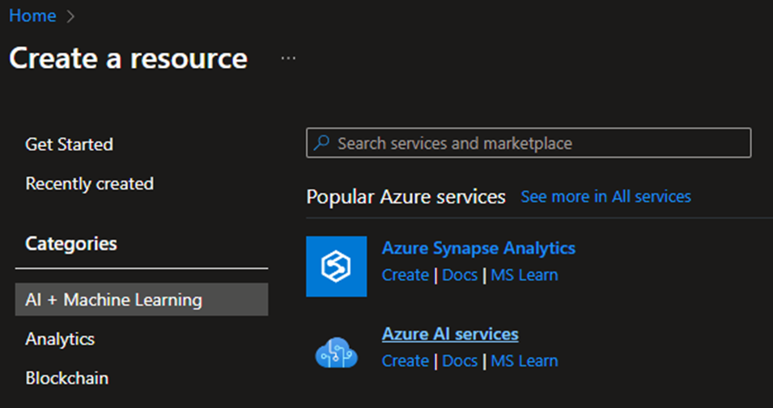
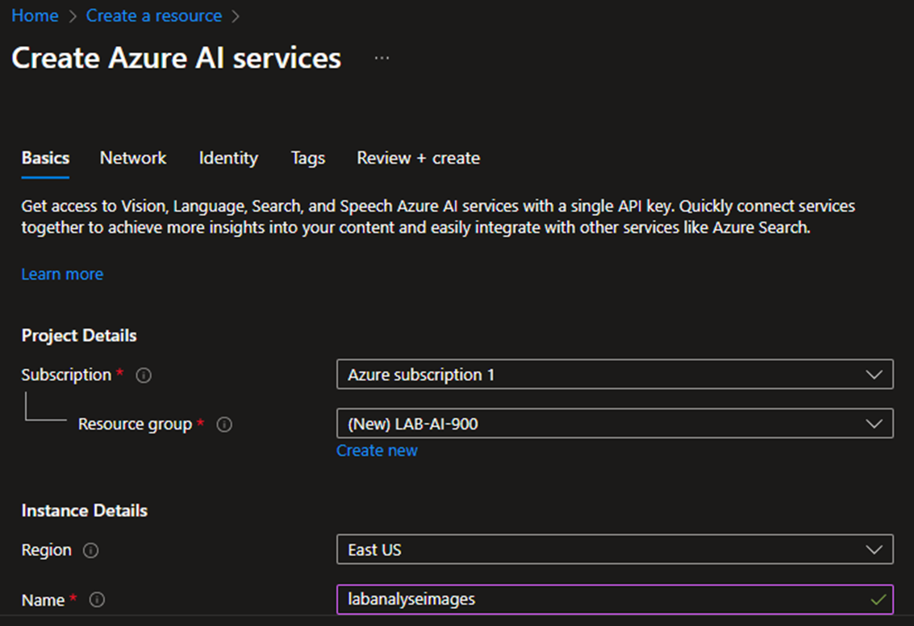
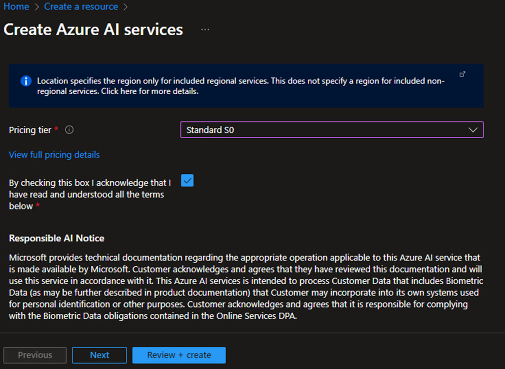
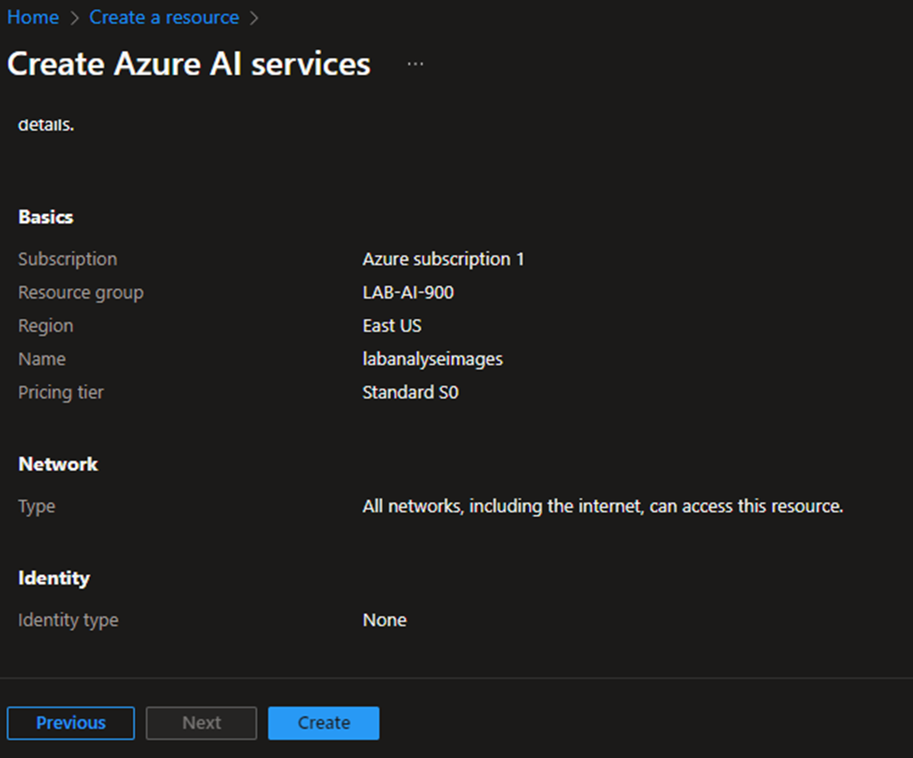
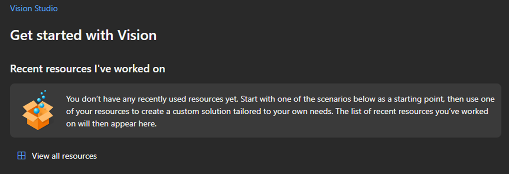
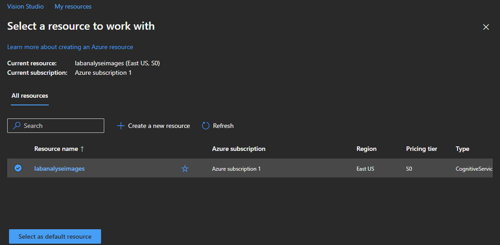
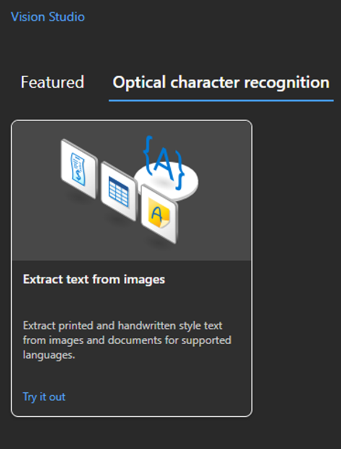
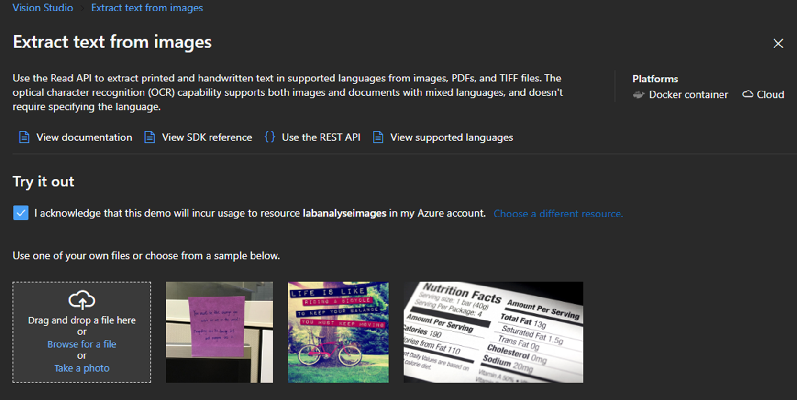
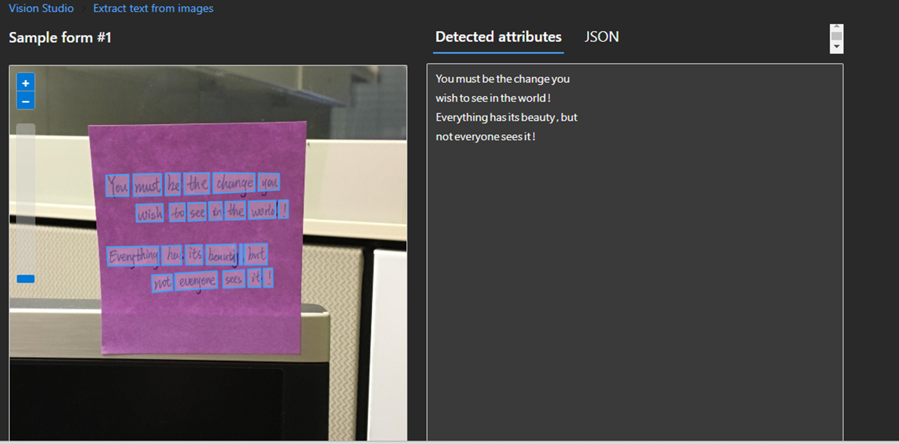

# Análise De Imagem Gerada Por Inteligência Artificial

## Geração Da Imagem

1 - Acessar o link <https://copilot.microsoft.com/>

2 - No prompt descrever a imagem com o texto desejado.
 
 
 

## Análise Da Imagem Gerada

1 - Acessamos o link https://portal.azure.com/ e criamos o recurso, na opção Create a resource.

 
 
 

2 - Dentro de AI + Machine Learning, selecionar a opção Azure AI services.

 
 
 

3 - Configuramos as opções e criamos o recusrso.

 
 
 

4 - Acessamos o link https://portal.vision.cognitive.azure.com/. Selecionamos a View all resource, para visualiuzar todos os recursos exixtentes. Selecionamos o recurso criado e definimos ele como padrão, na opção Select as default resource.

 
 
 

5 - Dentro da aba Optical character recognition, selecioanos a opção Extract text from images.

 
 
 

6 - Selecionamos a imagem que queremos detectar os textos.

 
 
 

7 - Abaixo na pagina é exibida a imagem selecionada e o resultado ao lado. São exibidos os textos detectados e o JSON.

